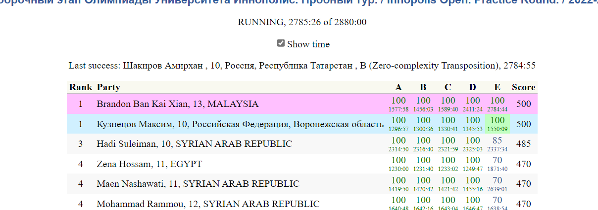

# Innopolis 2022 Informatics Competition Practice Round Solutions
This repository contains my solutions for the Innopolis 2022 Informatics Competition Practice Round. All of the solutions are written in Python.

## Practice Round Results
I'm happy to share that I have secured the first position in the practice round. It was an incredible experience participating in the competition and solving the questions.
 

## My Journey Solving the Questions
The Innopolis 2022 practice round was a challenging yet rewarding experience for me. I decided to use Python as my programming language of choice and started working on the solutions.

The first four questions, A + B, Zero-complexity Transposition, Big Array, and Guess the Number, were relatively easy to solve. I was able to implement them using my existing knowledge of programming and algorithms.

However, the fifth question, Error Correction, proved to be the hardest one. It involved using the Hamming Code method to perform error detection on an input string. I had never heard of this method before and had to spend almost half a day researching and understanding how to implement it.

After reading multiple articles and watching several videos, I finally grasped the concept and was able to implement the algorithm. It was a complex process, but I found it to be a valuable learning experience. In the end, I was able to solve the problem and felt a great sense of accomplishment. 

Overall, the practice round was a great way for me to challenge myself and expand my knowledge of programming and algorithms. I am excited to see what challenges lie ahead in the upcoming competition and look forward to further developing my skills.

P/S: I also included the explanation of the implementation of Hamming Code Method in the ErrorCorrection.py file

## Conclusion
Participating in the Innopolis 2022 Informatics Competition was an amazing experience for me. I'm grateful for the opportunity to compete and learn from other participants. I hope that my solutions can be helpful to other aspiring computer science enthusiasts. If you have any questions or feedback, feel free to reach out to me.